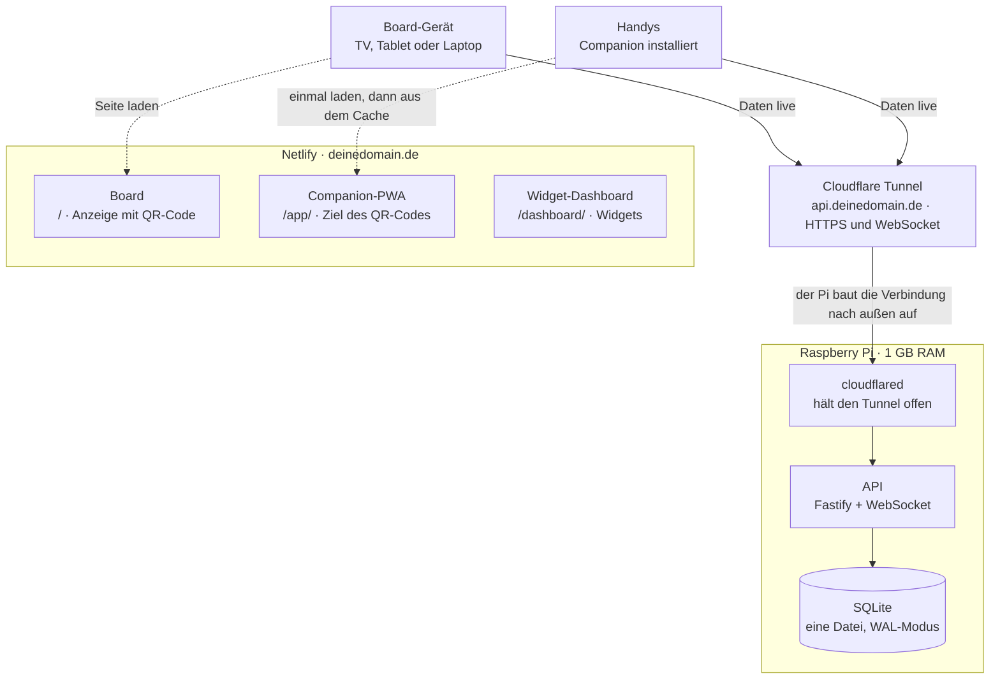

# Umbauplan Companion & Board

Stand: 05.10.2026 · Max

> **Umsetzung:** Seit dem 05.10.2026 läuft der Umbau im Repo `cloud7too9/Com-anion-Board` (Start ohne Verlauf, der alte Verlauf liegt in `flexibel-visionboard`). Die Haken in den Phasen werden hier gesetzt; den Stand je Phase führt [`UEBERGABE.md`](UEBERGABE.md), Kapitel 1 und 9. Phase 1 wird auf dem Branch `claude/vibrant-mccarthy-qzhzq4` gebaut (die Rolle von `umbau/server-absichern`).

## Zielbild

Am Ende liefert Netlify alles Sichtbare aus, der Pi hält nur noch die API und SQLite. Der Umbau braucht sechs Phasen und keine zweite Domain.

Gestrichelt: Seite laden, beim Handy nur einmal, danach kommt die Companion aus dem Cache. Durchgezogen: Daten und Live-Updates, immer über den Tunnel zum Pi.

## Eine Domain, drei Adressen

Eine Domain reicht völlig: Subdomains wie `api.` kosten nichts extra. Die Hauptdomain zeigt aufs Board, die API bekommt eine eigene Subdomain über den Tunnel. `deinedomain.de` steht hier als Platzhalter.

| Adresse | Zeigt auf | Inhalt |
| --- | --- | --- |
| `deinedomain.de` | Netlify | Board (heute `/anzeige`, später das Widget-Dashboard) |
| `deinedomain.de/app/` | Netlify | Companion-PWA, Ziel des QR-Codes |
| `api.deinedomain.de` | Cloudflare Tunnel → Pi | REST-API und WebSocket |

**Korrektur zum Chat:** Ein Tunnel ohne eigene Domain ist ein Quick Tunnel. Der bekommt bei jedem Start eine zufällige `trycloudflare.com`-Adresse, ist laut Cloudflare nur zum Testen gedacht und auf 200 gleichzeitige Anfragen begrenzt. Eine installierte PWA braucht aber eine feste API-Adresse. Deshalb läuft die API als benannter Tunnel auf `api.deinedomain.de` ([Quick Tunnels](https://developers.cloudflare.com/cloudflare-one/networks/connectors/cloudflare-tunnel/do-more-with-tunnels/trycloudflare/)).

Dafür muss die Domain im DNS von Cloudflare liegen:

1. Kostenlosen Cloudflare-Account anlegen, Domain hinzufügen, beim Registrar die Nameserver auf Cloudflare umstellen. Die Domain bleibt beim Registrar.
2. Hauptdomain auf Netlify: ein abgeflachter CNAME (`@` → `apex-loadbalancer.netlify.com`), ersatzweise ein A-Record auf `75.2.60.5`. Dazu `www` als CNAME auf `<seite>.netlify.app` ([Netlify: externes DNS](https://docs.netlify.com/manage/domains/configure-domains/configure-external-dns/)).
3. Die Netlify-Einträge auf „Nur DNS“ (graue Wolke) lassen, damit Netlify das Zertifikat selbst ausstellen kann.
4. `api` legt `cloudflared tunnel route dns` beim Einrichten des Tunnels selbst an.

Nebeneffekt: Der Tunnel baut die Verbindung vom Pi nach außen auf. Weder der Router deiner Mutter noch der in der neuen Wohnung muss angefasst werden, der Umzug ändert an der Adresse nichts.

## Ist-Stand im Repo

Heute ist der Board-Server alles auf einmal: Webserver für alle Seiten, Datenhaltung, Texterkennung und per `start.sh` sogar der Anzeige-Browser. Stand: `main`, Merge von PR #25 (`bereich/banner`) am 05.10.2026.

| Baustein | Heute | Nach dem Umbau |
| --- | --- | --- |
| Companion (`companion-prototyp.html`, `regeln.js`, `icons/`, `ruestungs-baukasten/`, `biom-*.js`, `vendor/`) | vom Server unter `/` | Netlify unter `/app/` |
| Anzeige (`koordinaten-board/client`) | Server unter `/anzeige` | Netlify unter `/` |
| Widget-Dashboard (`companion/widgets`) | Server unter `/dashboard` | Netlify unter `/dashboard/` |
| Daten | `daten.json`, komplett im RAM, als Ganzes neu geschrieben (`daten.js`) | SQLite auf dem Pi |
| Biome | `biome/<weltId>.json`, Upload bis 64 MB | SQLite, je Kachel eine Zeile |
| Texterkennung | `tesseract.js` auf dem Server (`erkennung.js`) | im Browser am Handy |
| Banner-Vorschau als PNG | Server (`pngjs`) | bleibt vorerst auf dem Pi |
| Regelprüfung | `regeln.js` per `node:vm` | bleibt auf dem Pi |
| Anzeige-Browser | Chromium-Kiosk aus `start.sh` | TV, Tablet oder Laptop, nie der Pi |

Drei Stellen gehen davon aus, dass Seite und API vom selben Server kommen:

- `API_BASIS = "/api"` in `companion-prototyp.html` (Zeile 1514) wird eine feste Adresse auf `api.deinedomain.de`.
- `client/src/lib/verbindung.ts` baut den WebSocket aus `location.host`. Das muss die API-Adresse werden, ebenso im Widget-Dashboard.
- CORS ist nur für drei Pfade offen, mit `*` und nur `GET, POST` (`server.js` Zeile 108–125). Nötig sind alle `/api`-Pfade, `PUT` und `DELETE`, und nur die eigene Domain.

**Sicherheitslücke, die vor dem Online-Gang weg muss:** `istLokal` (`server.js` Zeile 51) gibt Anfragen von `127.0.0.1` volle Anzeige-Rechte, also auch die Board-PIN. Hinter `cloudflared` kommt aber jede Anfrage aus dem Internet von `127.0.0.1`. Ohne Fix dürfte jeder Fremde Anzeige sein. Aus demselben Grund läge die PIN-Sperre, die die IP mitbekommt (Zeile 148 und 157), für alle auf einer einzigen Adresse.

## Umbauschritte

Sechs Phasen, jede als eigener Branch mit Pull Request wie bei `bereich/banner`. Die Reihenfolge ist Absicht: erst absichern, dann den Pi leichter machen, ganz zum Schluss online gehen. Bis Phase 5 läuft alles weiter lokal wie heute.

### Phase 1: Server absichern · Branch `umbau/server-absichern`

- [x] Sonderrecht für localhost streichen: Anzeige nur noch mit Anzeige-Link, `ANZEIGE_OFFEN` entfernen *(05.10.2026; der Server schreibt den Link der ersten Anzeige nach `daten/anzeige-link.txt`, die Startskripte öffnen ihn)*
- [x] Server nur auf `127.0.0.1` lauschen lassen statt `0.0.0.0`, dann erreicht ihn nur noch `cloudflared` *(05.10.2026, als `HOST`; **Standard bleibt `0.0.0.0`**, weil bis Phase 5 alles lokal weiterläuft und die Handys im WLAN den Server sonst nicht mehr erreichen. Die Dienstdatei in Phase 6 setzt `HOST=127.0.0.1`.)*
- [x] Echte Client-IP aus dem Header `CF-Connecting-IP` lesen, für PIN-Sperre und Anmeldung *(05.10.2026; der Header zählt nur bei Verbindungen von `127.0.0.1`, also von `cloudflared`)*
- [x] CORS für alle `/api`-Pfade und `/ws`: nur Ursprünge aus einer Liste (`ERLAUBTE_URSPRUENGE`, z. B. `https://deinedomain.de` und `http://localhost:5173`), Methoden inklusive `PUT` und `DELETE` *(05.10.2026; dazu immer der eigene Ursprung, solange der Server die Seiten ausliefert)*
- [x] Board-PIN auf mindestens 6 Ziffern *(05.10.2026; Erzeugung mit 6 Ziffern, kurze `RAUM_PIN` lehnt der Start ab, eine alte 4-stellige `pin.txt` wird ersetzt)*

Git: nach jedem Punkt `npm test` in `koordinaten-board`, dann committen (z. B. „Anzeige nur noch per Anzeige-Link“). Push und PR am Ende der Phase, die GitHub-Tests laufen mit.

### Phase 2: API-Adresse konfigurierbar · Branch `umbau/api-adresse`

- [x] Companion: `API_BASIS` aus einer Konfiguration lesen, Standard bleibt `/api` für lokal *(05.10.2026: `companion/konfig.js` mit `apiAdresse`, leer = eigener Ursprung; daraus `BOARD_ADRESSE` und `API_BASIS`, auch für Beitreten und WebSocket)*
- [x] Anzeige und Widget-Dashboard: `VITE_API_URL` für `fetch` und WebSocket statt `location.host` *(05.10.2026: `client/src/lib/api.ts`, `widgets/src/features/karten/lib/api.ts`)*
- [x] Lokal prüfen: Frontends über Vite, Server auf `:3000`, also schon getrennte Ursprünge *(05.10.2026: als Playwright-Test `companion/tests/getrennt.test.mjs`: Companion von einem eigenen Server, `konfig.js` zeigt aufs Board, Beitreten, API und Live über CORS)*

Git: ein Commit je Frontend, Playwright-Tests in `companion/tests` vor dem Push.

### Phase 3: Texterkennung ins Handy · Branch `umbau/ocr-im-browser`

- [x] Auswertung aus `erkennung.js`, `banner-erkennung.js`, `bildvorbereitung.js` in die Companion holen, `tesseract.js` läuft dort im Browser, Canvas ersetzt `jpeg-js` und `pngjs` *(05.10.2026: `companion/texterkennung.js`, klassisches Script wie `regeln.js`; tesseract.js lokal in `companion/vendor/tesseract/`, kopiert mit `tools/tesseract-kopieren.mjs`; nur der SIMD-Kern, Geräte ohne SIMD holen ihn vom CDN)*
- [x] `/api/orte/auslesen` und `tesseract.js` aus dem Server entfernen *(05.10.2026; auch `jpeg-js` und `@fastify/multipart`; `pngjs` bleibt für die Banner-Vorschau der Widgets)*
- [x] Erkennungs-Tests auf die Browser-Version umziehen *(05.10.2026: die reinen Auswertungs-Tests laufen weiter im Server gegen `companion/texterkennung.js` per `node:vm`; die echte OCR prüft `companion/tests/live.test.mjs` im Browser)*

Das ist der größte RAM-Gewinn auf dem Pi. Git: erst Browser-Version committen und testen, Server-Teil in einem eigenen Commit löschen.

### Phase 4: SQLite statt daten.json · Branch `umbau/sqlite`

- [x] Tabellen nach dem Datenmodell anlegen, jede Zeile mit `version`, dazu eine fortlaufende Änderungsnummer *(05.10.2026: `server/src/speicher.js`, `node:sqlite` im WAL-Modus; je Sammlung eine Tabelle `id, version, reihenfolge, daten (JSON)`, `werte` für Einstellungen und Zähler, `aenderungen(nr, sammlung, id, version, am)` als Änderungsnummer)*
- [x] Einmaliges Umzugsskript `daten.json` → SQLite, die JSON-Datei bleibt als Sicherung liegen *(05.10.2026: macht der Server beim ersten Start mit leerer `daten.db` selbst; von Hand `npm run nach-sqlite -- <Ordner>`)*
- [x] Biome je Kachel als Zeile statt einer großen JSON-Datei *(05.10.2026: `biome_import` + `biome_kacheln`, Kachel als BLOB)*
- [x] Die Schnittstelle von `daten.js` gleich lassen, dann bleiben `companion-api.js` und die Tests unverändert *(05.10.2026: `companion-api.js` unverändert; die Daten bleiben im Speicher, geschrieben wird nach 300 ms nur, was sich geändert hat. Zwei Tests lesen jetzt `daten.db` statt der JSON-Dateien. Braucht Node 22.13+.)*

Git: Schema, Umzugsskript und neue `daten.js` je ein Commit. Vor dem Merge das Umzugsskript gegen eine Kopie der echten `daten.json` laufen lassen.

### Phase 5: Netlify-Seite · Branch `umbau/netlify`

- [x] `netlify.toml` im Repo-Wurzelordner: baut Anzeige und Dashboard, kopiert die Companion nach `/app/` *(05.10.2026: `netlify.toml` + `netlify/bauen.sh`; die Adresse der API kommt aus der Netlify-Umgebungsvariable `API_URL` in `VITE_API_URL` und `app/konfig.js`)*
- [x] `_redirects` für die Routen von Anzeige und Dashboard (`/dashboard/*` → `index.html`) *(05.10.2026: `netlify/_redirects`, auch `/anzeige*` → `/index.html`)*
- [x] Companion installierbar machen: Manifest und Service Worker mit Scope `/app/`, App-Shell im Cache *(05.10.2026: `companion/manifest.webmanifest`, `companion/sw.js`, Icons in `companion/icons/app/`; nur aktiv, wenn `konfig.js` `pwa: true` setzt, lokal vom Board also nicht)*
- [x] QR-Code zeigt auf `https://deinedomain.de/app/?pin=…` (`OEFFENTLICHE_URL`) *(05.10.2026: neue Umgebungsvariable `COMPANION_PFAD=/app/` am Server, lokal bleibt `/`)*
- [ ] Erst mit der `.netlify.app`-Adresse testen, noch ohne Domain *(braucht Max: Netlify-Konto, Site aus dem GitHub-Repo, Umgebungsvariable `API_URL`. Lokal ist der ganze Stand geprüft: `companion/tests/netlify.test.mjs` baut wie Netlify und prüft Beitreten als PWA, QR-Code auf `/app/`, Anzeige und Dashboard mit Anzeige-Link, Kennblöcke, Offline aus dem Service Worker.)*

Git: Push löst bei Netlify einen Vorschau-Build für den PR aus, dort testen, dann mergen.

### Phase 6: Pi, Tunnel, Domain

- [ ] Repo auf dem Pi klonen, nur `koordinaten-board/server` installieren, als systemd-Dienst starten *(vorbereitet: `koordinaten-board/pi/companion-board.service`, `companion-board.env`, `sicherung.sh`, Befehle in `pi/ANLEITUNG.md`; ausführen muss Max am Pi)*
- [ ] `cloudflared` installieren, benannten Tunnel anlegen, `api.deinedomain.de` zuordnen, ebenfalls als Dienst *(vorbereitet: `pi/cloudflared-config.yml`, Befehle in `pi/ANLEITUNG.md`)*
- [ ] Domain auf Cloudflare-DNS umstellen und Netlify zuordnen (Abschnitt „Eine Domain, drei Adressen“) *(Schritte in `pi/ANLEITUNG.md`, Abschnitt 3)*
- [ ] Probe über Mobilfunk statt WLAN: QR scannen, beitreten, Ort anlegen, Board aktualisiert sich
- [ ] Aufräumen: `netzwerk.js`, Adress-Lernen und Firewall-Skripte werden für den Pi nicht mehr gebraucht

Git: Dienstdateien (`*.service`) und eine kurze Anleitung ins Repo, damit der Pi jederzeit neu aufsetzbar ist.

## Backend auf dem Pi

Auf dem Pi bleiben genau zwei Dienste: die API (Fastify mit WebSocket, dazu SQLite) und `cloudflared`. Kein Webserver für Seiten, keine Texterkennung, kein Browser.

**SQLite anbinden:** `node:sqlite` ist seit Node 22.13 ohne Flag nutzbar und seit 25.7 „Release Candidate“ ([Node-Doku](https://nodejs.org/api/sqlite.html)). Es spart das Kompilieren eines nativen Moduls auf dem Pi. Ist die Node-Version dort älter, ist `better-sqlite3` die Alternative. In beiden Fällen den WAL-Modus einschalten, dann blockiert Lesen nie das Schreiben.

**Versionen und Konflikte** (passt zum Bauplan Offline-Sync):

- Jede Zeile trägt `version`. Eine Änderung schickt `basisVersion` mit. Passt sie nicht, antwortet die API mit `409` und dem aktuellen Stand, die Companion fragt nach.
- Neue Einträge und Zustandswechsel (offen → erledigt) laufen ohne Rückfrage durch, das ist die Klasse „automatisch“.

**Live und Nachholen:**

- Nach jeder Änderung geht wie heute `geaendert` über den WebSocket raus, neu mit der fortlaufenden Änderungsnummer.
- Nach einem Verbindungsabbruch holt der Client mit `GET /api/aenderungen?seit=<nr>` nur, was fehlt. Liegt die Nummer zu weit zurück, lädt er alles neu.
- Erst danach arbeitet die Companion ihre Offline-Warteschlange ab.

**RAM messen statt raten:** `free -m` und `ps -o rss,cmd -C node,cloudflared` einmal vor Phase 3, nach Phase 3 und nach Phase 4. Im systemd-Dienst der API setzt `MemoryMax=` eine Leitplanke, damit ein Ausreißer nicht den ganzen Pi lahmlegt.

**Sicherung:** Die SD-Karte ist dann der einzige Ort der Daten. Nachts per Cron eine Kopie ziehen (`sqlite3 daten.db ".backup sicherung.db"`) und vom Pi wegkopieren, etwa auf den Laptop oder den Hetzner-Server.

## Offene Entscheidungen und Risiken

Fünf Fragen musst du klären, bevor Phase 5 und 6 starten können.

- [ ] Welche Domain, und lässt der Registrar das Umstellen der Nameserver zu? *(Max)*
- [ ] Welches Gerät zeigt das Board an (TV-Browser, Tablet, Laptop)? Der Pi fällt aus, Raspberry OS Lite hat keinen Desktop. *(Max; technisch egal, jedes Gerät mit Browser und Anzeige-Link)*
- [ ] Startseite der Domain: heutige Anzeige oder gleich das Widget-Dashboard, das sie später ersetzen soll? *(Max; gebaut ist: `/` = Anzeige, `/dashboard/` = Dashboard. Soll das Dashboard auf `/`, reicht eine Zeile in `netlify/_redirects`.)*
- [ ] Kommt nach `/app/` der Prototyp oder deine eigene `modul-a-live-karte.html`, die nicht im Repo liegt? *(Max; gebaut ist der Prototyp. Die eigene Datei müsste ins Repo und in `netlify/bauen.sh` statt `companion-prototyp.html` kopiert werden.)*
- [x] Welche Node-Version läuft auf dem Pi (`node -v`)? Ab 22.13 reicht `node:sqlite`. *(Entfällt: Der Pi bekommt laut Anleitung Node 22 LTS von NodeSource, `package.json` verlangt `>=22.13`.)*

| Risiko | Folge | Gegenmittel |
| --- | --- | --- |
| Board-PIN ist jetzt aus dem Internet erreichbar | Raten der PIN von außen | längere PIN, Sperre nach echter IP, optional Rate Limiting bei Cloudflare |
| Biom-Upload bis 64 MB als ein JSON | Parsen kann den Pi kurz an die RAM-Grenze bringen | in Paketen je Kachelgruppe hochladen |
| Pi oder Internet zuhause weg | Board zeigt nichts Neues | Companion arbeitet offline mit Warteschlange weiter (Bauplan Offline-Sync) |
| Nur eine Kopie der Daten auf der SD-Karte | Datenverlust bei Kartendefekt | nächtliche Sicherung vom Pi weg |
| Token steht beim WebSocket in der URL (`/ws?token=…`) | landet eventuell in Logs | später als erste Nachricht nach dem Verbindungsaufbau senden |

## Quellen

- [Cloudflare: Quick Tunnels](https://developers.cloudflare.com/cloudflare-one/networks/connectors/cloudflare-tunnel/do-more-with-tunnels/trycloudflare/)
- [Netlify: externes DNS für eigene Domain](https://docs.netlify.com/manage/domains/configure-domains/configure-external-dns/)
- [Node.js: SQLite](https://nodejs.org/api/sqlite.html)
- Repo [cloud7too9/flexibel-visionboard](https://github.com/cloud7too9/flexibel-visionboard), `main` vom 05.10.2026
